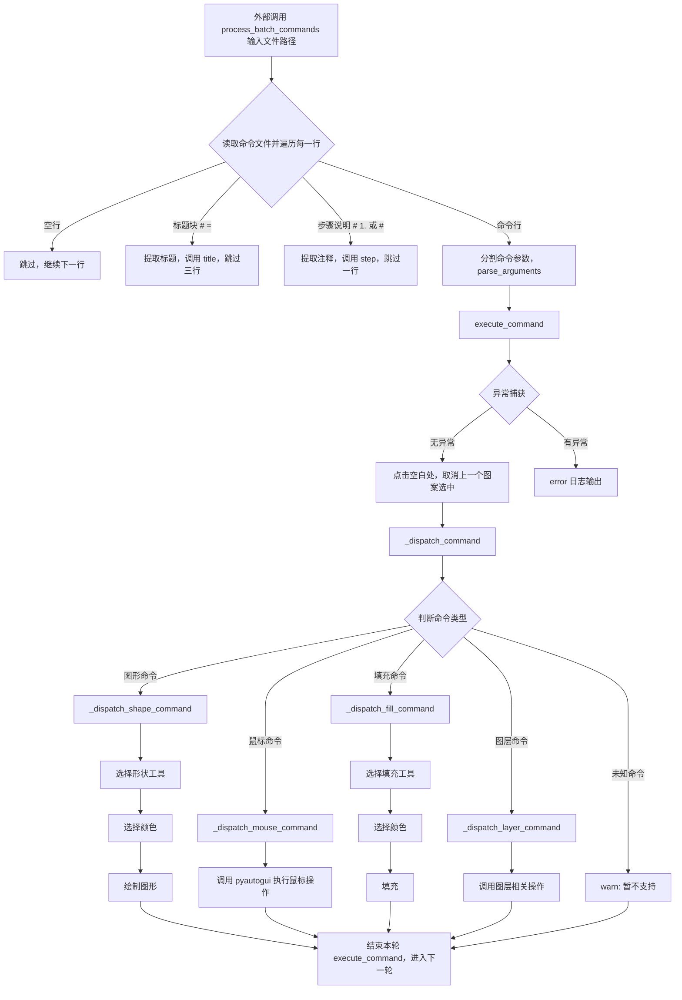

```mermaid
flowchart TD
    A[外部调用 process_batch_commands 输入文件路径 ] --> B{读取命令文件并遍历每一行}
    B --> |空行| C[跳过，继续下一行]
    B --> |标题块 # = | D[提取标题，调用 title，跳过三行]
    B --> |步骤说明 # 1. 或 # | E[提取注释，调用 step，跳过一行]
    B --> |命令行| F[分割命令参数，parse_arguments]
    F --> G[execute_command]
    G --> H{异常捕获}
    H --> |无异常| I1[点击空白处，取消上一个图案选中]
    I1 --> I2[_dispatch_command]
    H --> |有异常| J[error 日志输出]
    I2 --> K{判断命令类型}
    K --> |图形命令| L[_dispatch_shape_command]
    K --> |填充命令| M[_dispatch_fill_command]
    K --> |鼠标命令| N[_dispatch_mouse_command]
    K --> |图层命令| O[_dispatch_layer_command]
    K --> |未知命令| P[warn: 暂不支持]
    
    N --> Q[调用 pyautogui 执行鼠标操作]

    L --> R1[选择形状工具]
    R1 --> R2[选择颜色]
    R2 --> R3[绘制图形]

    M --> S1[选择填充工具]
    S1 --> S2[选择颜色]
    S2 --> S3[填充]

    O --> T[调用图层相关操作]
    
    R3 --> U[结束本轮 execute_command，进入下一轮]
    Q --> U
    S3 --> U
    T --> U
    P --> U
```