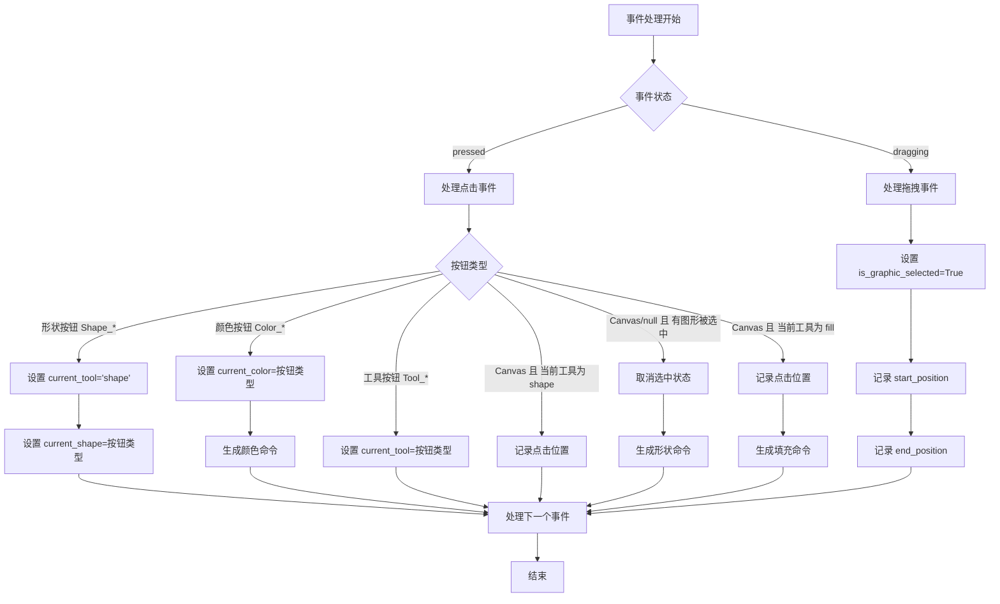
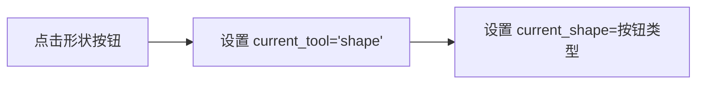
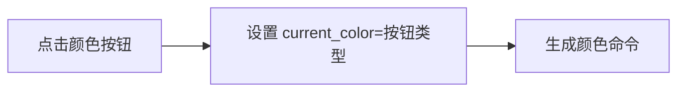
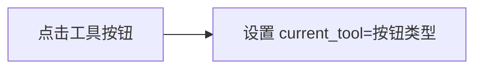
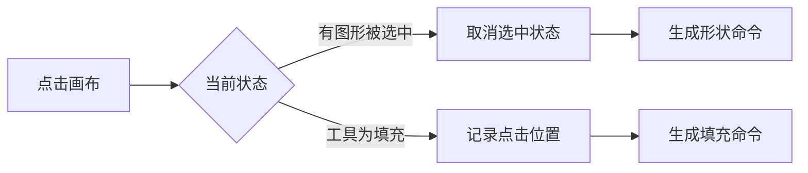
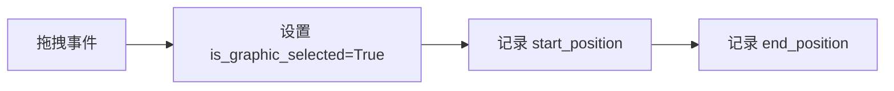

***command_generator.py***

## 详细处理流程说明

### 1. 事件状态判断
- **pressed**：鼠标/触摸按下事件
- **dragging**：拖拽事件

### 2. pressed状态处理
根据点击的按钮类型进行不同处理：

#### 2.1 形状按钮（如`Shape_line`）

#### 2.2 颜色按钮（如`Color_black`）

#### 2.3 工具按钮（如`Tool_pen`）

#### 2.4 画布区域点击

### 3. dragging状态处理

### 4. 关键变量说明

| 变量名 | 类型 | 描述 |
|--------|------|------|
| `current_tool` | string | 当前选中的绘图工具（pen, shape, fill等） |
| `current_shape` | string | 当前选中的图形类型（line, circle, rectangle等） |
| `current_color` | string | 当前选中的绘图颜色 |
| `is_graphic_selected` | boolean | 标记是否有图形正在被绘制/选中 |
| `start_position` | tuple (x,y) | 绘图动作的起始位置坐标 |
| `end_position` | tuple (x,y) | 绘图动作的结束位置坐标 |

## 处理逻辑总结

1. **按下(pressed)事件处理**：
    - 形状按钮：更新当前工具为形状模式，记录具体形状类型
    - 颜色按钮：更新当前颜色，生成颜色设置命令
    - 工具按钮：更新当前绘图工具
    - 画布点击：
        - 当有图形选中时：取消选中状态并生成最终形状命令
        - 当工具为填充时：记录点击位置并生成填充命令

2. **拖拽(dragging)事件处理**：
    - 设置图形选中状态为True
    - 记录拖拽的起始和结束位置（用于后续形状生成）

3. **命令生成时机**：
    - 颜色命令：在颜色按钮点击时立即生成
    - 填充命令：在画布点击且工具为填充时生成
    - 形状命令：在取消选中状态时生成（完成图形绘制）

该流程图准确反映了代码中的事件处理逻辑，特别完善了以下关键点：
1. 区分了不同按钮类型（形状/颜色/工具）的处理
2. 明确了画布点击的两种不同处理路径
3. 展示了命令生成的三种不同时机
4. 强调了拖拽事件仅记录位置而不立即生成命令
5. 保持了全局状态变量的更新路径清晰可见