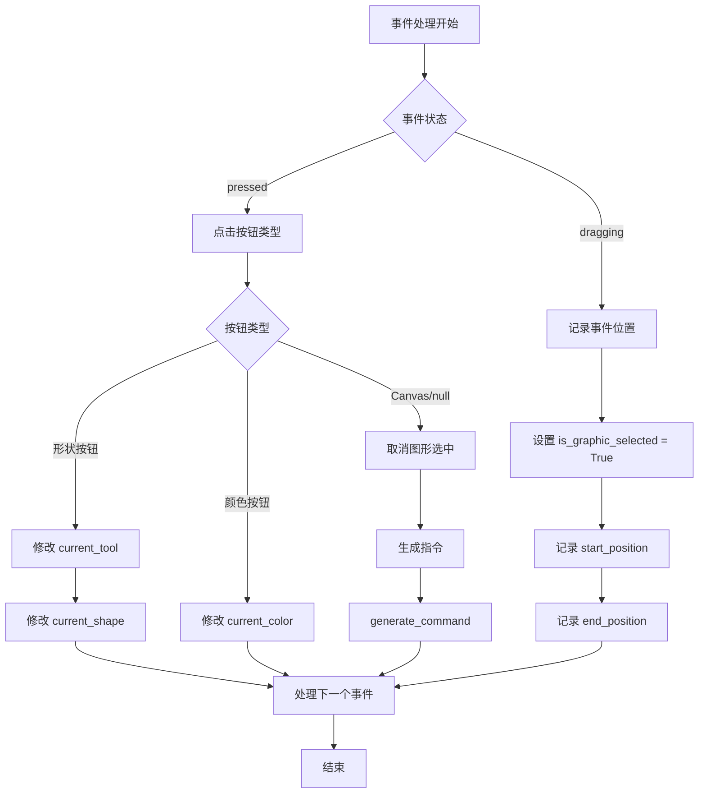
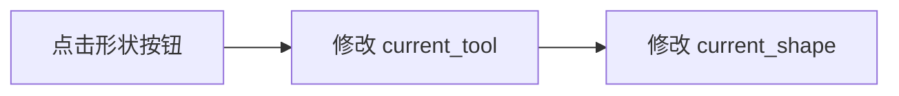
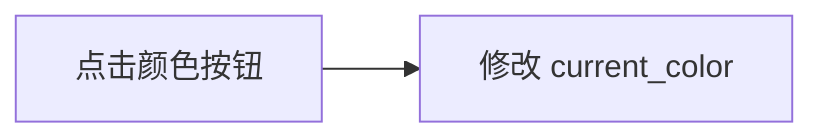
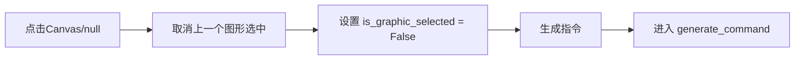
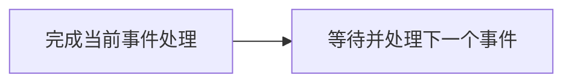

# 事件处理流程文档

## 流程图



## 详细处理流程

### 1. 事件状态判断
- **pressed**：鼠标/触摸按下事件
- **dragging**：拖拽事件

### 1a. pressed状态处理
根据点击的按钮类型进行不同处理：

#### 1a. 形状按钮（如`Shape_line`）


#### 1b. 颜色按钮（如`Color_black`）


#### 1c. Canvas或null区域


### 1b. dragging状态处理
```mermaid
graph LR
    A[拖拽事件] --> B[设置 is_graphic_selected = True]
    B --> C[记录 event['start_position']]
    C --> D[记录 event['end_position']]
```

### 2. 处理下一个事件


## 关键变量说明

| 变量名 | 类型 | 描述 |
|--------|------|------|
| `current_tool` | string | 当前选中的绘图工具 |
| `current_shape` | string | 当前选中的图形类型 |
| `current_color` | string | 当前选中的绘图颜色 |
| `is_graphic_selected` | boolean | 是否有图形被选中 |
| `event['start_position']` | tuple (x,y) | 事件开始位置坐标 |
| `event['end_position']` | tuple (x,y) | 事件结束位置坐标 |

## 处理逻辑总结

1. 当事件为**按下(pressed)**状态时：
    - 如果点击形状按钮：更新当前工具和形状
    - 如果点击颜色按钮：更新当前颜色
    - 如果点击画布或空白区域：取消选中并生成图形指令

2. 当事件为**拖拽(dragging)**状态时：
    - 标记图形为选中状态
    - 记录拖拽的起始和结束位置

3. 完成当前事件处理后，继续处理下一个事件

该流程确保用户交互能够正确更新绘图状态并记录绘图操作，为生成最终图形指令提供必要的数据支持。